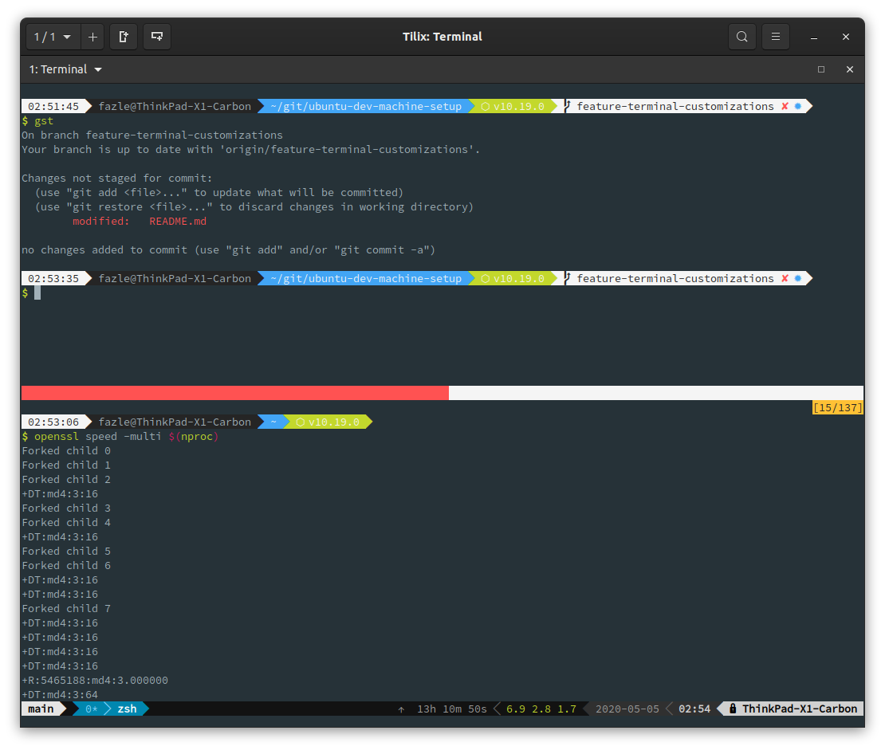

# ubuntu-dev-machine-setup | Ubuntu 20.04 LTS

This repo contains Ansible playbooks to configure your system as a development machine upon a clean install.

The playbooks should run in Debian based system but was only tested with:
- **Ubuntu 20.04**
- **Ubuntu Budgie 20.04**

For other versions of Ubuntu, change to the other branches of this git repo.


Screenshot above is using *bullet-train zsh theme*


Screenshot above is using *pure zsh theme*



Screenshot above is using *bullet-train zsh theme with tmux*


## Pre-requisites

On the system which you are going to setup using Ansible, perform these steps.

You need to install `ansible` and `git` before running the playbooks. You can either install it using `pip` or `apt`.

```
sudo apt install ansible git
```

And clone this repo

```
git clone https://github.com/fazlearefin/ubuntu-dev-machine-setup.git
cd ubuntu-dev-machine-setup
```

## Running the playbooks to configure your system

**Invoke the following as yourself, the primary user of the system. Do not run as `root`.**

```
ansible-playbook main.yml -e "{ laptop_mode: True }" -e "{ virtual_machine_mode: False }" -e "local_username=$(id -un)" -K
```

Enter the sudo password when asked for `BECOME password:`.

The `main.yml` playbook will take anything from 15 minutes to an hour to complete.

After all is done, give your laptop a new life by rebooting.

### What is this `laptop_mode`?

#### Setting this to `True`

- will install some packages like [TLP](https://github.com/linrunner/TLP) for battery economy
- will not install and configure ssh server

#### Setting this to `False`

- will not install some packages like `powertop` for battery economy
- will install and configure ssh server

### What is this `virtual_machine_mode`?

This is to tell if you are configuring Ubuntu on a virtual machine.

#### Setting this to `True`

- will not install docker, virtualbox and vagrant

## What gets installed and cofigured?

I am a Linux Systems Engineer and my daily job include working with various config management using Ansible. So if you are in a similar profession the installed system will suit your needs. It is also easy to extend using Ansible roles.

Summary of packages that get installed and configured:

- Archiving tools like zip, rar, etc
- Customization tools like gnome-tweak-tool, etc
- Power management tools like [TLP](https://github.com/linrunner/TLP)
- Download utils like aria2, wget, axel, etc
- Developer tools like awscli, httpie, clusterssh, docker, vagrant, virtualbox, ghostwriter markdown editor, etc
- Google Chrome
- Visual Studio Code and some popular extensions
- Git Bash Prompt
- ssh server
- zsh shell, antigen plugin manager, oh-my-zsh plugins
- remmina to connect to Windows over RDP (and also transfer files between your Linux machine and remote Windows host)
- Nerd Fonts
- Reduce swappiness for better perfomance
- Mount `/tmp` on tmpfs
- Enable ufw firewall and configure for incoming ssh
- Install [amix/vimrc](https://github.com/amix/vimrc) Vim Distribution
- Generate a `.zshrc` to enjoy zsh right away
  - Enable `oh-my-zsh` and some bundled plugins
  - Enable [bullet-train zsh theme](https://github.com/caiogondim/bullet-train.zsh)
  - Function to stop ssh-agent from asking for encrypted ssh key password repeatedly when launching new terminal
- Sample `.tmux.conf` file with powerline status bar and mouse support! (Open Tilix terminal and run `tmux` command, or enable custom command option in Tilix)
- `tor` and `proxychains4` for anonymous browsing. Visit [my blog post](https://fazlearefin.blogspot.com/2020/07/tunneling-traffic-over-tor-network.html) to see how to use it

## Known Issues

- If the ansible playbook halts after completing a few tasks, simply run the playbook again. Since most of the tasks are idempotent, running the playbook multiple times won't break anything.
- If your terminal shows any weird characters because of installing one of the zsh themes, simply change the font to a suitable Nerd Font from the terminal's settings.

## Pull Requests and Forks

You are more than welcome to send any pull requests. However, the intention of this repo is to suit my development needs. So it might be better if you *fork* this repo instead for your own needs and personalization.

## Donations

Bitcoin (BTC): `38uvDLV4GzcAB7qMUEM5chqivESqNPWPZW`

Ethereum (ETH): `0xb87A10e8e3fa4Ea71b478f8f0c8798977dBe28Ed`

Litecoin (LTC):`MRAwH2WHUprCn5RcpKWKMkfaUJicTpsbWr` or `3Jxny96KXhzmya9iiSWyY7RB9c8AXRGN3n`
