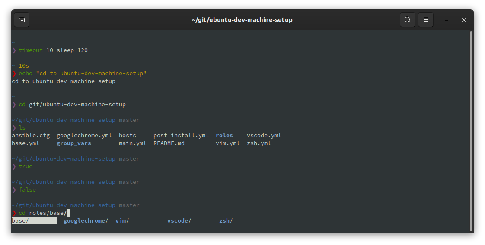
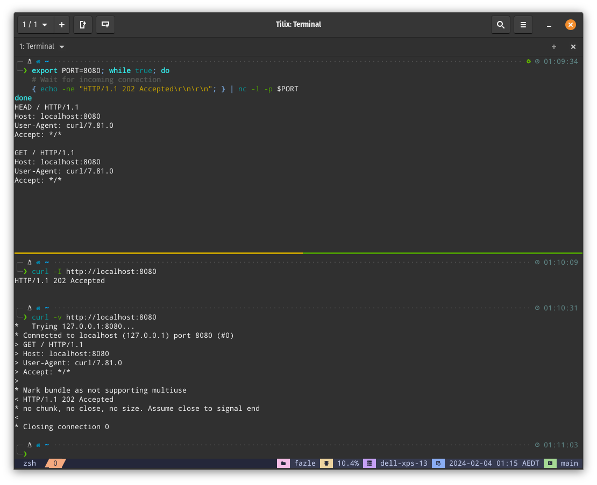

# ubuntu-dev-machine-setup | Ubuntu 24.04 | Linux Mint 22

## Description

This repo contains Ansible playbooks to configure your system as a development machine upon a clean install.

The playbooks should run in Debian based system with minor modifications but was only tested with:

- **Ubuntu 24.04 LTS (Noble Numbat)**
- **Linux Mint 22 (Wilma)**

For other versions of Ubuntu, change to the other branches of this git repo. Other versions include Ubuntu 18.04 LTS, 20.04 LTS, 22.04 LTS.


Screenshot above is using *bullet-train zsh theme*



Screenshot above is using *pure zsh theme*



Screenshot above is using *p10k zsh theme with tmux*

---

## What gets installed and cofigured?

I am a DevSecOps Engineer and my daily job include working with AWS, docker, ansible, terraform, etc. So if you are in a similar profession the installed system will suit your needs. It is also easy to extend using Ansible roles.

Summary of packages that get installed and configured based on roles:

- **role: base**
  - mount `/tmp` on tmpfs (reduce SSD read writes and increase SSD lifespan; no leftover files on system shutdown)
  - set default system editor to vim instead of nano
  - enable ufw firewall and install ufw graphical frontend gufw
  - disable system crash reports
  - tune system swappiness so that swapping is greatly reduced
  - upgrade all packages
  - install archiving tools like zip, rar, etc
  - install libreoffice
  - install foliate, an e-book reader
  - install glow, apostrophe and Obsidian markdown editors
  - install dive, a tool for exploring each layer in a docker image
  - install power management tools like [TLP](https://github.com/linrunner/TLP)
  - install development related packages like android-tools, awscli, httpie, clusterssh, docker, filezilla, golang, pipenv, etc
  - install nala, an alternative package management tool to apt/apt-get
  - install code fomatters and linters like black, ruff, ansible-lint, etc
  - setup golang directories
  - install download tools like axel, transmission, wget, aria2
  - install image, audio and video packages like vlc, totem, gimp, imagemagick, etc
  - install virtualization tools like virtualbox, docker, docker-compose
  - install and configure ssh server if not set to `laptop_mode`
  - option to turn on night light settings for eye comfort (set `base_permanent_night_light.night_light_enabled` to `True`)
  - enable `fzf` fuzzy finder in zsh terminal; check out this [YouTube video](https://www.youtube.com/watch?v=1a5NiMhqAR0) to see how to use it
  - install terminal emulators Tilix and Alacritty
  - install [lazygit](https://github.com/jesseduffield/lazygit)
- **role: zsh**
  - install zsh package and set user shell to zsh
  - install antigen zsh plugin manager
  - copy and enable sample `~/.zshrc` file if one does not exist
    - contains function to stop ssh-agent from asking for encrypted ssh key password repeatedly when launching new terminal
    - adds additional shell aliases and functions in `~/.shell_aliases` and `~/.shell_functions`
  - install ohmyzsh/ohmyzsh and enable some bundled plugins
  - enable bullet train zsh theme (others like p10k can be configured as well)
- **role: terminal_customizations**
  - download and install some nerd fonts from ryanoasis/nerd-fonts; these are mono fonts ideal for use in terminal or programming editors
  - copy and enable sample tilix config file with configured nerd font
  - copy sample alacritty config file
  - copy and enable sample tmux config file if one does not exist
  - copy and enable sample `~/.tmux.conf` file with [tmux plugin manager](https://github.com/tmux-plugins/tpm) and several tmux plugins
    - open Tilix terminal and run `tmux` command, or enable custom command option in Tilix
    - edit `~/.tmux.conf` if necessary
- **role: vim**
  - install vim packages
  - install [amix/vimrc](https://github.com/amix/vimrc) vim distribution
  - create sample vim customization file in `~/.vim_runtime/my_configs.vim`
    - additional vim settings are enabled in `~/.vim_runtime/my_configs.vim` which are not part of the Vim Distribution. Edit this file if necessary.
- **role: neovim**
  - install neovim packages
  - install [lazyvim](https://www.lazyvim.org) neovim distribution
    - open `nvim` from terminal and let the plugins get installed automatically on the initial launch
- **role: vscode**
  - add Visual Studio Code apt repo
  - install Visual Studio Code
  - install some popular Visual Studio Code extensions
- **role: privacy**
  - install tor
  - configure tor to run at boot and prevent using certain countries as exit nodes
    - edit `/etc/tor/torrc` if necessary
  - install proxychains
  - configure proxychains to use tor. View [my Medium story](https://luiscamaral.medium.com/tunneling-traffic-over-tor-network-using-proxychains-34c77ec32c0f) to see how to use it
    - edit `/etc/proxychains4.conf` if necessary
  - install metadata anonymization toolkit
- **role: security**
  - install ClamAV (antivirus) and ClamAV GNOME interface. Manual scan from nautilus or from CLI using `clamscan`; clamd not installed for its huge memory footprint
  - install firejail for sanboxing applications
  - enable additional apparmor profiles
- **role: hashicorp**
  - install vagrant, terraform, packer
- **role: googlechrome**
  - add Google Chrome apt repo
  - install Google Chrome

---

## Step 0 | Pre-requisites for running the ansible playbooks

On the system which you are going to setup using Ansible, perform these steps.

You need to install `ansible` and `git` before running the playbooks. You can either install it using `pip` or `apt`.

```bash
/usr/bin/sudo apt update
/usr/bin/sudo apt full-upgrade -y
/usr/bin/sudo apt install ansible git -y
```

And clone this repo (do not clone in `/tmp` as this dir is cleaned and mounted in tmpfs)

```bash
git clone https://github.com/luiscamaral/ubuntu-dev-machine-setup.git
cd ubuntu-dev-machine-setup
```

## Step 1 | Running the playbooks to configure your system

**Invoke the following as yourself, the primary user of the system. Do not run as `root`.**

```bash
ansible-playbook main.yml -vv -e "{ laptop_mode: True }" -e "local_username=$(id -un)" -K
```

Enter the sudo password when asked for `BECOME password:`.

The `main.yml` playbook will take anything from 15 minutes to an hour to complete.

After all is done, give your laptop a new life by rebooting.

> ### What is this `laptop_mode`?

#### Setting this to `True`

- will install some packages like [TLP](https://github.com/linrunner/TLP) for battery economy

#### Setting this to `False`

- will NOT install some packages like [TLP](https://github.com/linrunner/TLP) for battery economy

---

## Known Issues

- If the ansible playbook halts after completing a few tasks, simply run the playbook again. Since most of the tasks are idempotent, running the playbook multiple times won't break anything.
- If your terminal shows any weird characters because of installing one of the zsh themes, simply change the font to a suitable Nerd Font from the terminal's settings.
- If you do not like the fuzzy finder completions in your terminal, remove or comment out the `#fzf` lines in your `~/.zshrc` (this is not a known issue but a feature)
- When launching the terminal, having some [ohmyzsh](https://github.com/ohmyzsh/ohmyzsh) plugins like **docker** enabled results in the error: `tee: <snip> No such file or directory`. You can easily fix this by creating the missing directory manually: `mkdir -p ~/.antigen/bundles/robbyrussell/oh-my-zsh/cache/completions`.

---

## Pull Requests and Forks

You are more than welcome to send any pull requests. However, the intention of this repo is to suit my development needs. So it might be better if you *fork* this repo instead for your own needs and personalization.

---

## Donations

If you think my work helped you in some way saving you time and effort, I am happy to receive any amount of donation. However, the code in this repo is completely free; absolutely *no strings attached*.

Bitcoin (BTC): `bc1qzlhpm94vtk2ht67etdutzcy2g5an5v6g36tp0m`
